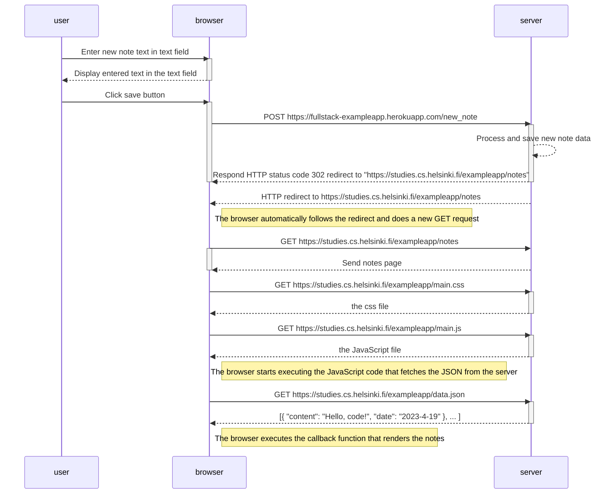

```mermaid
sequenceDiagram
    participant user
    participant browser
    participant server
    
    user->>browser: Enter new note text in text field
    activate browser
    browser-->>user: Display entered text in the text field
    deactivate browser
    
    user->>browser: Click save button
    activate browser
    browser->>server: POST https://fullstack-exampleapp.herokuapp.com/new_note
    activate server
    server-->>server: Process and save new note data
    server-->>browser: Respond HTTP status code 302 redirect to "https://studies.cs.helsinki.fi/exampleapp/notes"
    deactivate server
    deactivate browser
    
    server-->>browser: HTTP redirect to https://studies.cs.helsinki.fi/exampleapp/notes
    
    Note right of browser: The browser automatically follows the redirect and does a new GET request
    
    browser->>server: GET https://studies.cs.helsinki.fi/exampleapp/notes
    activate browser
    server-->>browser: Send notes page
    deactivate browser
    
    browser->>server: GET https://studies.cs.helsinki.fi/exampleapp/main.css
    activate server
    server-->>browser: the css file
    deactivate server

    browser->>server: GET https://studies.cs.helsinki.fi/exampleapp/main.js
    activate server
    server-->>browser: the JavaScript file
    deactivate server

    Note right of browser: The browser starts executing the JavaScript code that fetches the JSON from the server

    browser->>server: GET https://studies.cs.helsinki.fi/exampleapp/data.json
    activate server
    server-->>browser: [{ "content": "Hello, code!", "date": "2023-4-19" }, ... ]
    deactivate server

    Note right of browser: The browser executes the callback function that renders the notes

```
